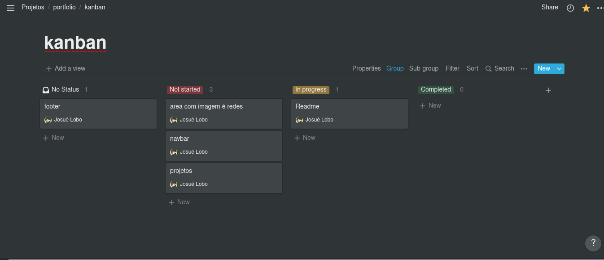

# Bem-vindo ao meu Portfólio

Este é o código fonte do meu portfólio, usei o notion para a
idealização e organização, git para versionamento, github para hospedagem de código, react como framework de desenvolvimento, Bootstrap para estilização e heroku para deploy da aplicação.

## Tools

- Git
- ReactJs
- Bootstrap
- Heroku


## Organization of directories

```
$ROOT
├── public # images and static files
├── README.md # project documentation 
└── src
    ├── App.js # main page
    └── components # react components 
```

## Notion 



[link para o notion desta aplicação](https://woozy-jelly-bcf.notion.site/60176da86c3c4ffea972dbe2ea24d800?v=07b5258969324191993c83ec8934ed2b)
